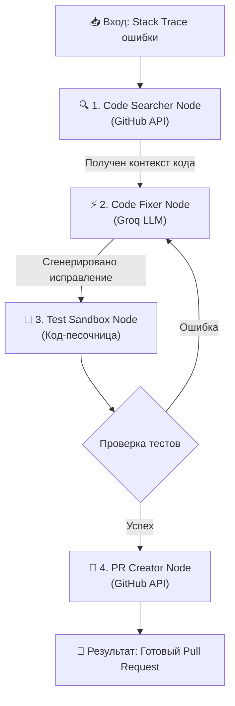

🤖 Automated Bug Investigator & PR Reviewer
Multi-Agent DevTools System based on LangGraph & Groq LLM

Автономная мультиагентная система для автоматического поиска, исправления багов в Python-коде и создания Pull Request'ов на GitHub.

📌 О проекте
Проект решает проблему рутинной отладки кода. Когда в системе происходит сбой, агент автоматически подтягивает упавший стек-трейс, находит проблемный файл в репозитории GitHub, генерирует исправление, проверяет его в изолированной песочнице и выкатывает готовый Pull Request.

🏗 Архитектура мультиагентной системы (LangGraph)
Система построена на базе паттерна Actor-Critic (Исполнитель — Критик) с циклом самоисправления (Self-Correction Loop):

## 🏗 Архитектура мультиагентной системы (LangGraph)

Система построена на базе паттерна **Actor-Critic (Исполнитель — Критик)** с циклом самоисправления (Self-Correction Loop). Оркестрация узлов выполняется с помощью LangGraph.


Роли агентов:
🔍 Code Searcher: Анализирует ошибку и загружает нужные файлы из репозитория GitHub.

⚡ Code Fixer: Анализирует traceback и генерирует исправленный вариант кода.

🧪 Test Sandbox: Выполняет код в изолированной среде. Если тесты не пройдены — отправляет код обратно Code Fixer на повторную доработку.

🚀 PR Creator: Создает отдельную ветку в Git, коммитит изменения и открывает настоящий Pull Request.

🚀 ```Быстрый старт
1. Клонирование репозитория
   
git clone https://github.com/ZiVaGowo/Project_3.git
cd Project_3

2. Настройка виртуального окружения
   
# Создание виртуального окружения
python -m venv .venv

# Активация (Windows PowerShell)
.venv\Scripts\Activate.ps1

# Активация (Linux/macOS)
source .venv/bin/activate

# Установка зависимостей
pip install -r requirements.txt

3. Настройка переменных окружения (.env)
Создайте файл .env в корне проекта и добавьте ключи доступа:

GROQ_API_KEY=gsk_your_groq_api_key
GITHUB_TOKEN=ghp_your_github_personal_access_token

Важно: Для GITHUB_TOKEN требуется классический токен с включенными правами repo (Full control of private repositories).

💻 Использование
Убедитесь, что в целевом репозитории на GitHub присутствуют тестируемые файлы (например, calculator.py).

Запустите главный скрипт:

python main.py

Пример вывода системы:

🔍 [1. Code Searcher] Сбор контекста кода...
⚡ [2. Code Fixer (Groq)] Попытка генерации #1...
🧪 [3. Test Sandbox] Проверка сгенерированного кода...
✅ Тесты пройдены!
🚀 [4. PR Creator] Создание Pull Request...

=== Результат работы ===
Успешно! Ссылка на PR: https://github.com/ZiVaGowo/Project_3/pull/1

🛠 Технологический стек
Python 3.10+

LangGraph / LangChain — оркестрация и управление состоянием агентов.

Groq API — высокоскоростная генерация решений с помощью LLM.

PyGithub — интеграция с REST API GitHub (ветки, файлы, Pull Requests).

Python Exec / Subprocess — изолированное тестирование кода.
